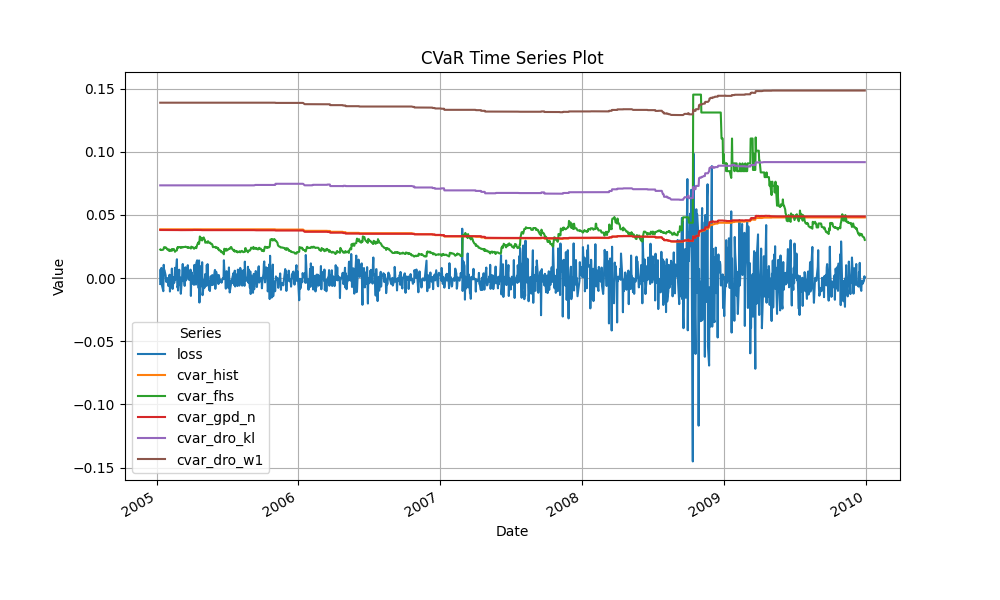

### Methods
Historical CVaR (cvar_hist)
Computes CVaR directly from the empirical loss distribution in each rolling window.

Pros: Nonparametric, model-free.

Cons: Underestimates tail risk when sample size is small or extreme events are scarce.

Filtered Historical Simulation (cvar_fhs)
Applies a GARCH filter to de-volatilize returns before computing CVaR, then re-scales back.

Pros: Captures time-varying volatility.

Cons: Relies on correct GARCH specification; can still miss unprecedented shocks.

Parametric GPD CVaR (cvar_gpd_n)
Fits a Generalized Pareto Distribution (GPD) above a high threshold and uses its closed-form tail formulas.

Pros: Smooth tail extrapolation beyond sample data.

Cons: Sensitive to threshold choice; may understate risk if shape is misspecified.

Distributionally Robust CVaR, KL‐Divergence (cvar_dro_kl)
Solves a worst-case CVaR under an 
𝛼
α-divergence ball around the nominal model. This yields a “heavier‐tailed” effective shape parameter but still respects a finite divergence budget.

Pros: Automatically adapts to emerging tail behavior, guarding against small model misspecifications.

Cons: Requires calibrating the divergence radius; involves a Lagrange multiplier 
𝜃
θ.

Distributionally Robust CVaR, Wasserstein‐1 (cvar_dro_w1)
Similar worst-case CVaR but with a Wasserstein‐1 constraint instead of KL. Produces an even more conservative (heavier) tail.

Pros: Strong guarantees under metric perturbations.

Cons: Often overly conservative—large capital reserves.

2. Results & Discussion

Historical CVaR (orange) remains quite low and only slowly increases toward the crisis period. It fails to bound large losses in late 2008: realized spikes in losses exceed it, risking uncovered exposure.

FHS CVaR (green) reacts to volatility clustering and spikes sharply in Q4 2008, but its magnitude often overshoots the realized loss—tying up capital that may never be needed.

Parametric GPD CVaR (red) is smooth and monotonic. It underestimates the deepest drawdowns around the Lehman failure, because the fitted tail shape cannot anticipate the unprecedented jump.

DRO–KL CVaR (purple) “hugs” the loss series most closely. It rises just enough to cover each new loss spike without overreacting, keeping capital reserves efficient.

DRO–W1 CVaR (brown) is the most conservative across the board. Even in calm periods it stays high (∼15%)—protecting against extreme transport-type model shifts but at the cost of large opportunity cost.

3. Key Takeaways
Coverage vs. Efficiency Trade-off

Under-coverage (Hist., GPD) can leave the portfolio exposed to ruinous losses.

Over-coverage (FHS, Wasserstein-DRO) ties up too much capital in buffers.

Best Balance
The KL‐Divergence DRO approach delivers a middle ground: it adaptively inflates the tail just enough to cover observed losses (“hugs” the series) while avoiding the overly pessimistic levels of the Wasserstein DRO.
