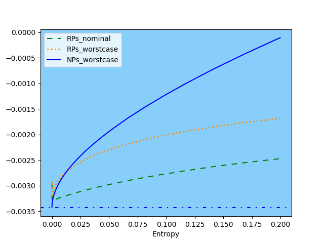

## Mean–Variance Risk Assessment

This module applies a robust risk-measurement framework to traditional mean–variance portfolio optimization. We:  
Compute robust portfolio weights by solving a mean–variance problem under an entropy-budget constraint (θ).  
Compare those weights and the associated risk forecast to the nominal (classical) mean–variance solution.  
Evaluate the accuracy of our robust variance forecasts against realized variances during historical crises.

### Crisis Case Studies
2008 Housing Crisis
Entropy budget (θ): 700

Forecasted variance: 2.39 × 10⁻⁴  
±2 Std Err: ±2.66 × 10⁻⁵

Realized variance: 8.57 × 10⁻⁴

Worst-case forecasted variance: 4.91 × 10⁻⁴  
Std Err (worst case): 3.18 × 10⁻⁵  
Model error: 2.52 × 10⁻⁴  
95% confidence interval (incorporating both error terms):  
(1.75 × 10⁻⁴, 8.06 × 10⁻⁴)

2020 COVID Crisis
Entropy budget (θ): 900

Forecasted variance: 2.98 × 10⁻⁴  
±2 Std Err: ±3.95 × 10⁻⁵

Realized variance: 1.33 × 10⁻³

Worst-case forecasted variance: 7.05 × 10⁻⁴  
Std Err (worst case): 6.04 × 10⁻⁵  
Model error: 4.07 × 10⁻⁴  
95% confidence interval:  
(1.77 × 10⁻⁴, 1.23 × 10⁻³)

Insight: Incorporating the model-error adjustment in the robust forecast brings our variance predictions much closer to the realized outcomes.

## Entropy Budget Estimation
The script EntropyBreachEstimation.py reverse-engineers the entropy budget by matching:

Robust Risk(𝜃) vs. Realized Risk  
on the “Risk vs. Entropy” curve.  

We find that an entropy budget of θ ≈ 0.225 best aligns the robust forecast with actual risk.

Toward a Systemic Risk Index  
By calibrating θ in this way, we can define a Risk Index that dynamically tracks market-wide systemic risk:

1. Estimate θ each period via the entropy-breach procedure.  
2. Translate θ into a normalized index value.  
3. Monitor the index as an early warning signal of emerging risk.  
